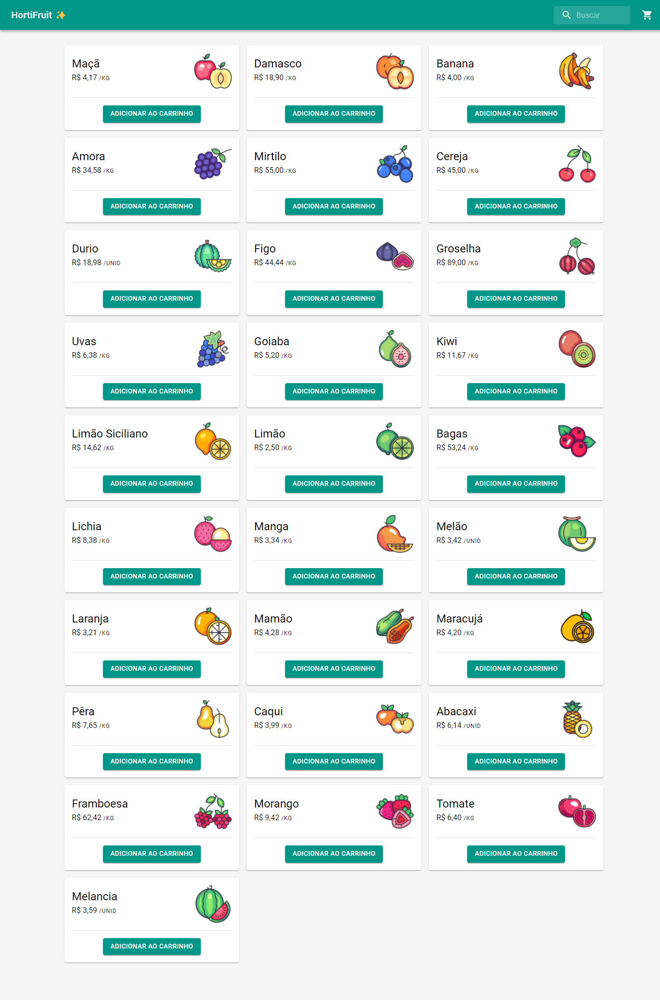
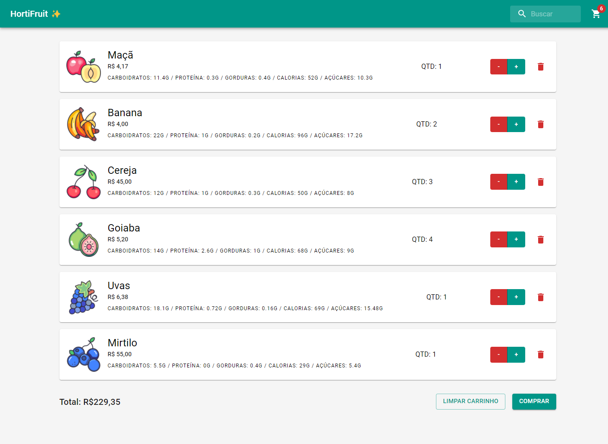

<h1>HortiFruti ✨ - Shopping Cart</h1>

&nbsp;

> E-commerce simples consumindo API de frutas, desenvolvido com React e Material UI 🛒

## 💻 Sobre o Projeto

Caso de estudo sobre um carrinho de compras para uma loja de hortifruti. A ideia principal deste projeto é praticar conceitos do framework React para construção de páginas dinâmicas e de componentização.

Para o design, foi utilizado a biblioteca Material UI, que facilita no momento de criação de componentes e no design responsivo.

Enfrentei alguns problemas com o projeto, tais como o bloqueio do CORS para requisições API, que contornei através desta [extensão do Google Chrome](https://chrome.google.com/webstore/detail/allow-cors-access-control/lhobafahddgcelffkeicbaginigeejlf)

> OBS: Após instalar a extensão, certifique-se de ativá-la!

## 🚀 Tecnologias e Ferramentas

_Este projeto foi desenvolvido com:_

- React.js
- React Router DOM
- Material UI

## 📚 Aprendizado

_Neste projeto eu pratiquei:_

- Consumo de API REST
- Create React App
- React Components
- React Hooks (_useState, useEffect, useContext_)
- React Routes

## 🥵 Dificuldades

_Dificuldades que encontrei e pontos para melhorar!_

- Bloqueio CORS na requisição da API
- Organização do projeto
- Lógica de funcionamento "espalhada"
- Aplicação da SSOT (_Single Source of Truth_)

## ⚙️ Materiais Utilizados

- API REST: [Fruityvice API ](https://www.fruityvice.com/)
- Icons: [Material Icons](https://mui.com/pt/components/material-icons/)
- Imagens: [Kerismaker - Flaticon](https://www.flaticon.com/br/buscar?author_id=337&style_id=1225&type=standard&word=frutas&k=1642701749007)

## 💻 Telas

_Você pode conferir o projeto [clicando aqui!](https://hortifruti-dannesx.vercel.app/)_

## 🤖 Créditos & Agradecimentos

_Sem eles, este projeto não seria possível!_

- [Diego Fernandes](https://www.rocketseat.com.br/)
- [André Rafael](https://www.origamid.com/)
- [Scrimba](https://scrimba.com/)

Um agradecimento especial à empresa [Frexco](https://frexco.com.br/) por ter me concedido tal desafio.

## 📋 Licença

Este projeto está sob a licença [MIT](LICENSE). Projeto realizado apenas para fins didáticos. Fique à vontade para utilizar todo o conteúdo deste repositório!

---

Obrigado pela atenção! 😃
